Spark 2.4.5 源码编译及 IDEA 阅读环境搭建

主要参考 coderap 的博客：

https://blog.coderap.com/article/291?browse_auth=36e1a5072c78359066ed7715f5ff3da8

# Spark源码分析01 - 源码编译及阅读环境搭建

## 1. 使用 Maven 编译 Spark 源码

可以直接从 Spark 官网下载对应版本源码，为了查看不同版本，本次从 GitHub clone 源码，并根据 tag 创建想要的版本的分支

1. 从 GitHub clone 源码并创建对应分支

   ```shell
   cd code/public
   git clone git@github.com:apache/spark.git
   cd spark/
   git checkout -b 2.4.5-code-analyze v2.4.5
   ```

2. 将 spark 父目录下的 pom.xml 文件中的 `java.version` 和 `maven.version` 版本修改为和本地环境一致，我这里刚好一样

   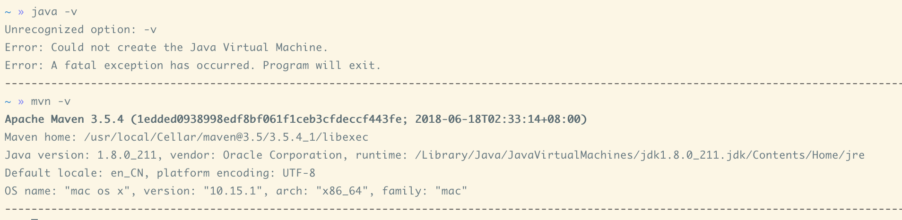

   ```xml
   <properties>
     <java.version>1.8</java.version>
     <maven.version>3.5.4</maven.version>
   </properties>
   ```

3. 使用 Maven 编译

   先修改 MAVEN_OPTS 增加编译时内存大小，然后直接在 spark 目录下执行变异

   ```shell
   export MAVEN_OPTS="-Xmx2g -XX:MetaspaceSize=2G -XX:ReservedCodeCacheSize=2G"
   mvn -Pyarn -Phadoop-2.7 -Pspark-ganglia-lgpl -Pkinesis-asl -Phive -Phive-thriftserver -DskipTests clean package
   ```

   完成后得到提示信息

   ```shell
   ...
   [INFO] ------------------------------------------------------------------------
   [INFO] Reactor Summary:
   [INFO]
   [INFO] Spark Project Parent POM 2.4.5 ..................... SUCCESS [  2.581 s]
   [INFO] Spark Project Tags ................................. SUCCESS [  4.074 s]
   [INFO] Spark Project Sketch ............................... SUCCESS [  5.105 s]
   [INFO] Spark Project Local DB ............................. SUCCESS [  2.619 s]
   [INFO] Spark Project Networking ........................... SUCCESS [  4.695 s]
   [INFO] Spark Project Shuffle Streaming Service ............ SUCCESS [  2.335 s]
   [INFO] Spark Project Unsafe ............................... SUCCESS [  6.705 s]
   [INFO] Spark Project Launcher ............................. SUCCESS [  4.243 s]
   [INFO] Spark Project Core ................................. SUCCESS [02:03 min]
   [INFO] Spark Project ML Local Library ..................... SUCCESS [ 20.857 s]
   [INFO] Spark Project GraphX ............................... SUCCESS [ 27.482 s]
   [INFO] Spark Project Streaming ............................ SUCCESS [ 47.446 s]
   [INFO] Spark Project Catalyst ............................. SUCCESS [01:46 min]
   [INFO] Spark Project SQL .................................. SUCCESS [02:55 min]
   [INFO] Spark Project ML Library ........................... SUCCESS [02:08 min]
   [INFO] Spark Project Tools ................................ SUCCESS [  4.601 s]
   [INFO] Spark Project Hive ................................. SUCCESS [01:22 min]
   [INFO] Spark Project REPL ................................. SUCCESS [ 18.063 s]
   [INFO] Spark Project YARN Shuffle Service ................. SUCCESS [  6.167 s]
   [INFO] Spark Project YARN ................................. SUCCESS [ 28.596 s]
   [INFO] Spark Project Hive Thrift Server ................... SUCCESS [ 25.572 s]
   [INFO] Spark Ganglia Integration .......................... SUCCESS [  4.966 s]
   [INFO] Spark Project Assembly ............................. SUCCESS [  3.240 s]
   [INFO] Spark Integration for Kafka 0.10 ................... SUCCESS [ 22.904 s]
   [INFO] Kafka 0.10+ Source for Structured Streaming ........ SUCCESS [ 32.782 s]
   [INFO] Spark Kinesis Integration .......................... SUCCESS [ 30.658 s]
   [INFO] Spark Project Examples ............................. SUCCESS [ 22.467 s]
   [INFO] Spark Integration for Kafka 0.10 Assembly .......... SUCCESS [  2.524 s]
   [INFO] Spark Avro ......................................... SUCCESS [ 21.370 s]
   [INFO] Spark Project Kinesis Assembly 2.4.5 ............... SUCCESS [  6.023 s]
   [INFO] ------------------------------------------------------------------------
   [INFO] BUILD SUCCESS
   [INFO] ------------------------------------------------------------------------
   [INFO] Total time: 16:14 min
   [INFO] Finished at: 2020-06-12T16:03:56+08:00
   [INFO] ------------------------------------------------------------------------
   ```


## 2. 搭建 IDEA 阅读环境

导入工程

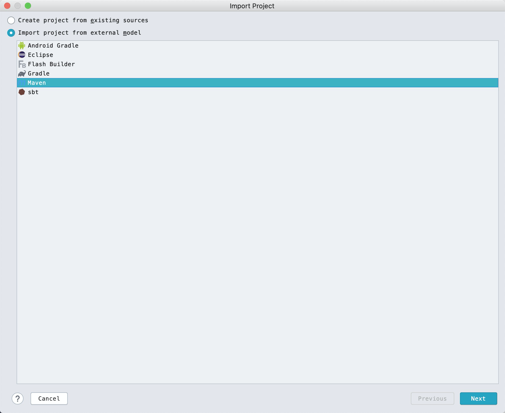

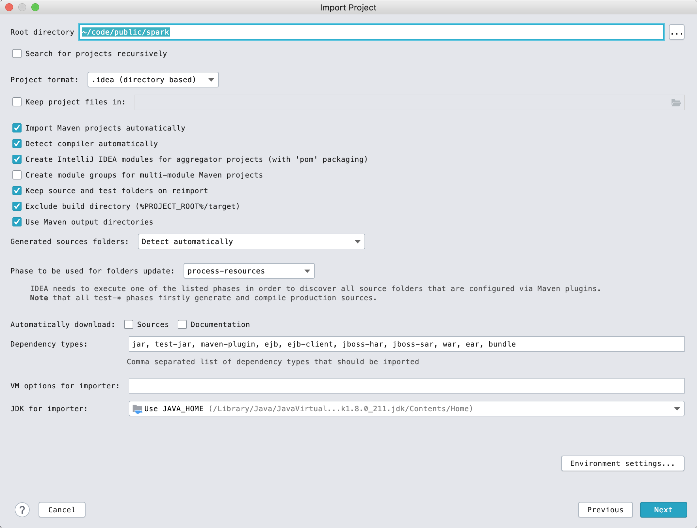

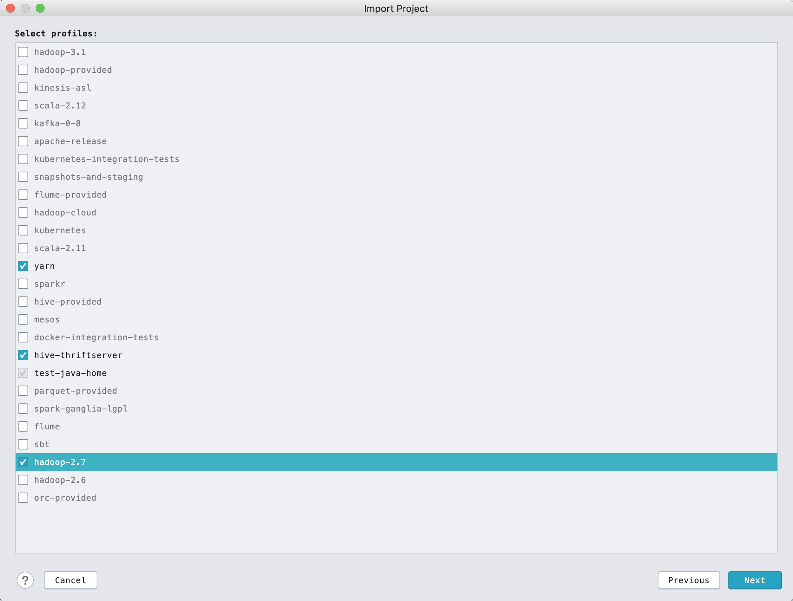

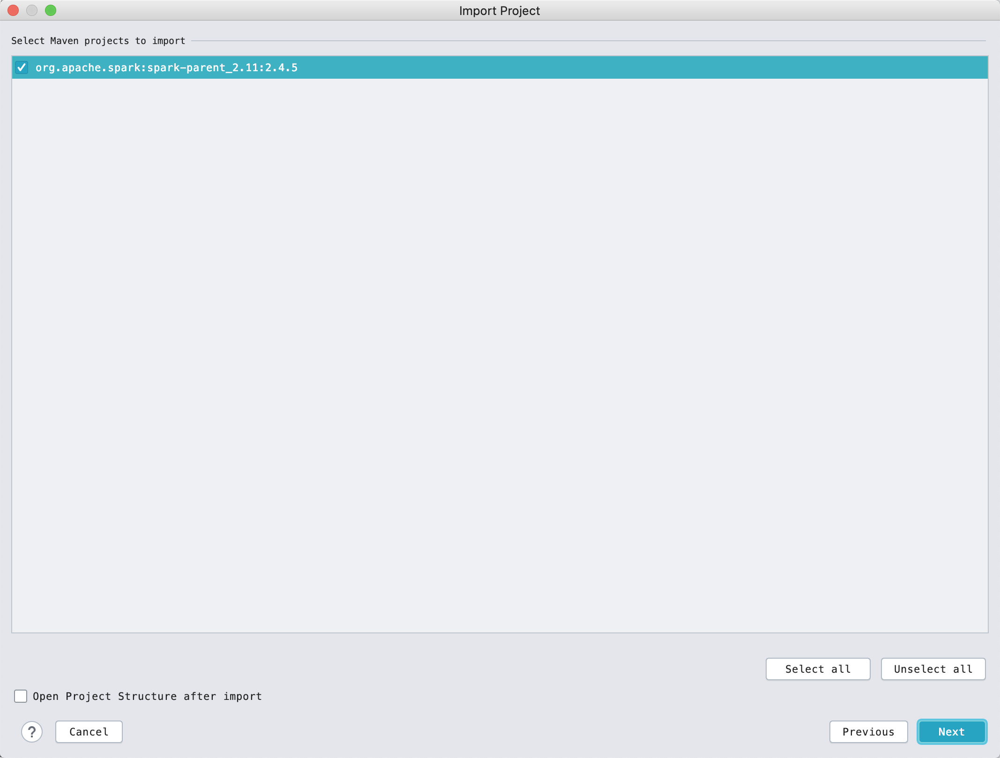

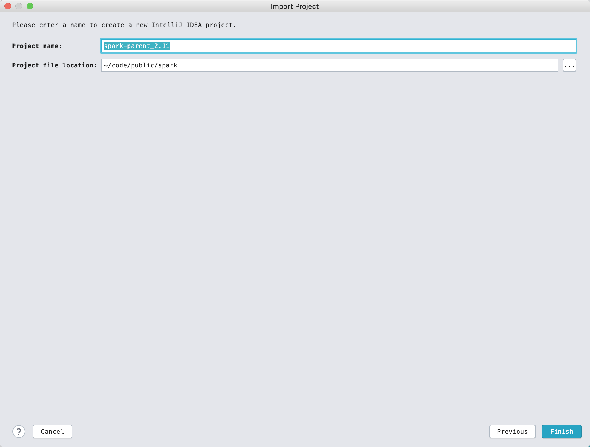

点击maven面板中的 `Generate Sources and Update Folders For All Projects` 

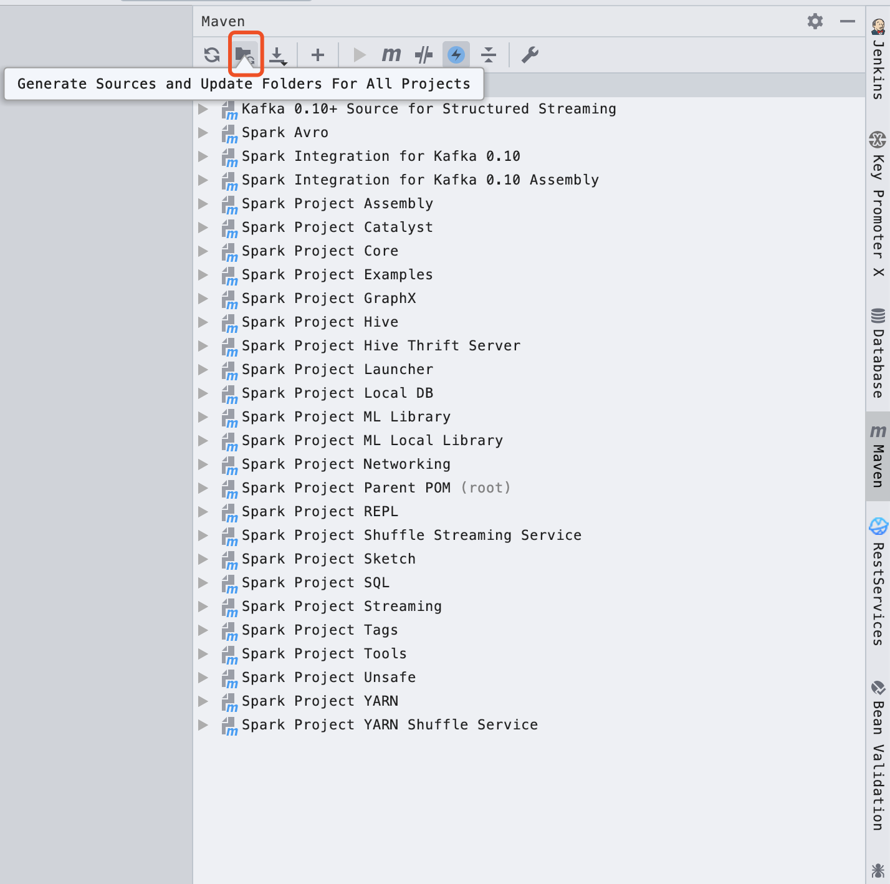

调整一下 `hive-thriftserver` 模块的结构，不然会得到一个报错信息 `java: 程序包org.eclipse.jetty.server不存在` ，注意把 `gen` 的 `Sources` 去掉，否则会报错信息 `xxx is already defined as object xxx` 

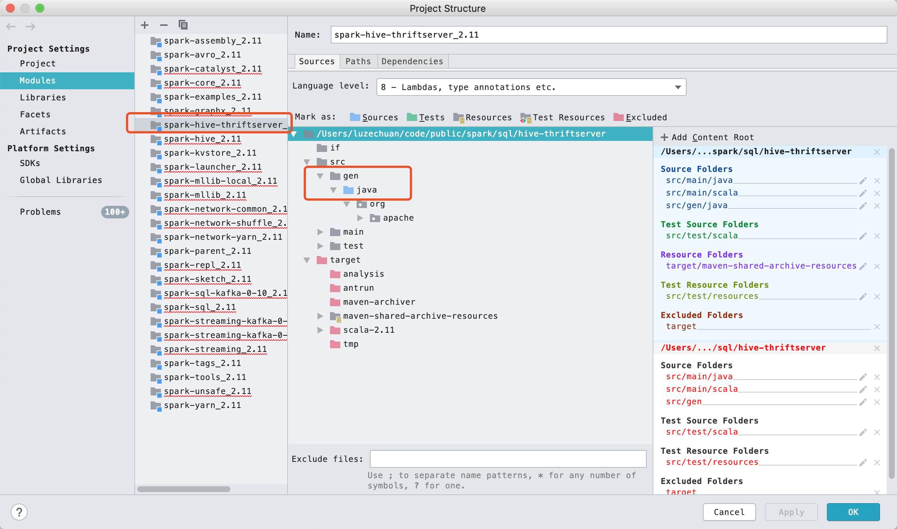

点击 build

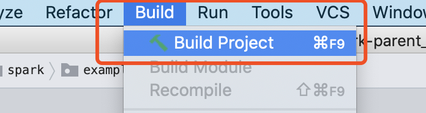

完成后会得到信息：

`Build completed successfully with 245 warnings in 9 m 29 s 210 ms` 

## 3. 运行example和master、worker

### 运行 SparkPi

将 `assembly/target/scala-2.11/jars` 添加到 examples 模块依赖

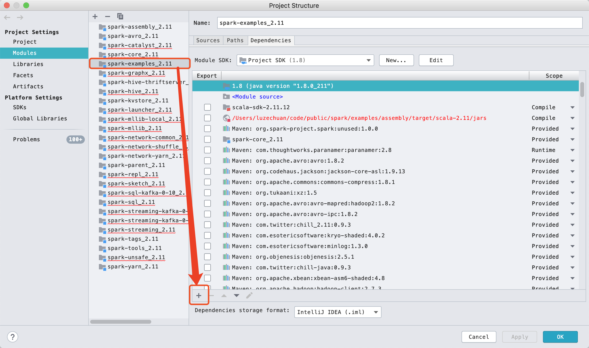

配置 SparkPi 运行环境

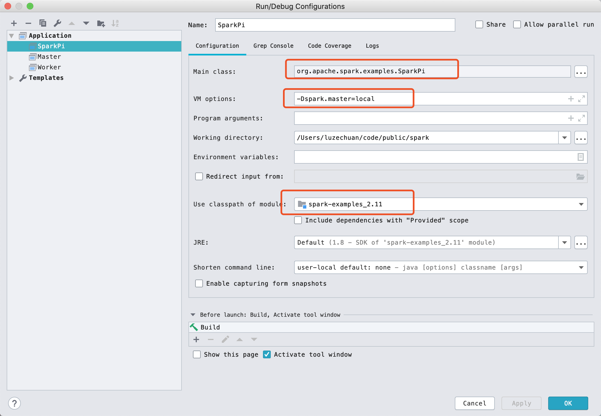

### 运行 Master 和 Worker

修改 `spark-core` 模块的引用依赖的编译范围，不然运行将会直接结束推出

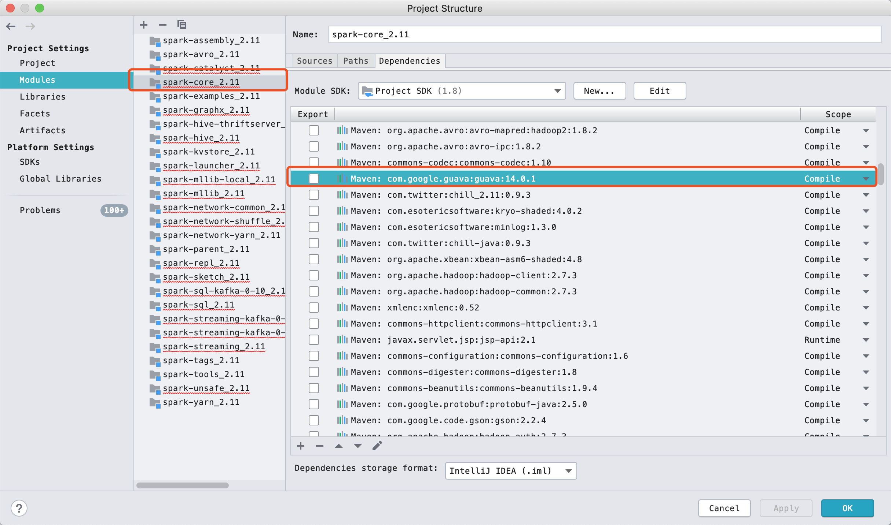

配置 Master 运行环境

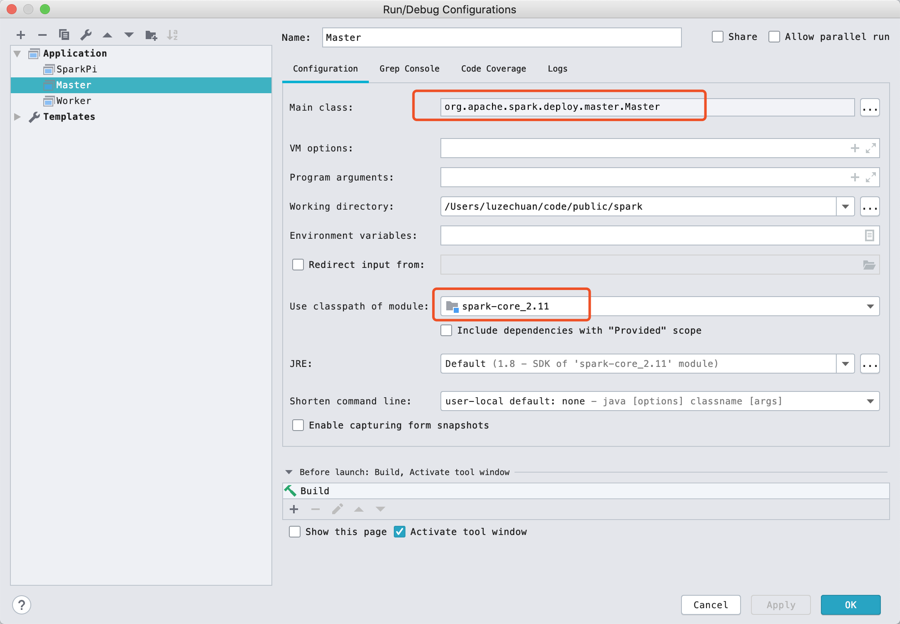

运行后，从控制台信息可以得到 Master URL: `Starting Spark master at spark://192.168.10.188:7077` 以及 MasterWebUI: `Bound MasterWebUI to 0.0.0.0, and started at http://192.168.10.188:8080` 

配置 Worker 运行环境

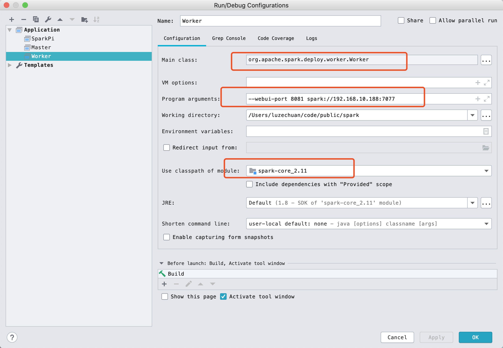

